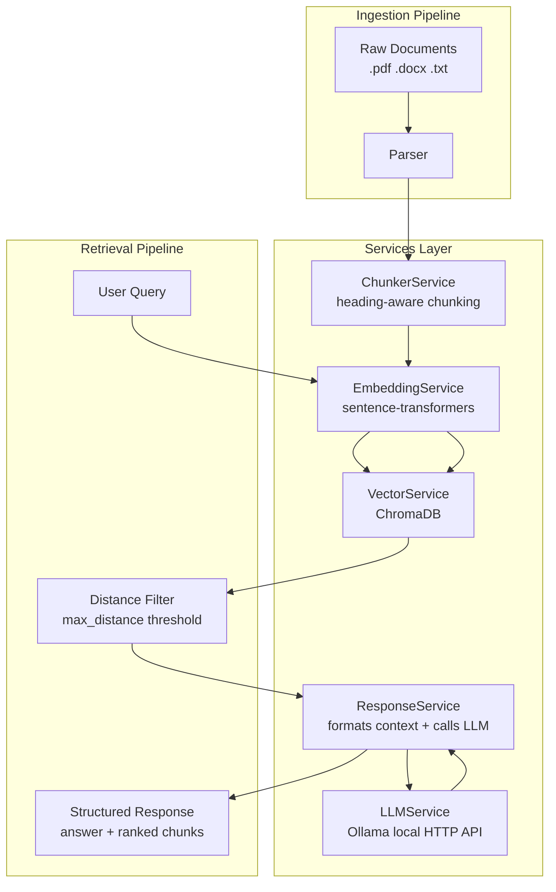

# RAG Pipeline - Project Plan

## Overview

A service-oriented RAG (Retrieval-Augmented Generation) system with four dedicated service classes
consumed by an ingestion pipeline and a retrieval pipeline.

---

## Architecture



---

## Libraries

| Library                    | Purpose                                      |
|---------------------------|----------------------------------------------|
| `pymupdf`                 | PDF text extraction (page-by-page)           |
| `python-docx`             | Word document (.docx) parsing                |
| `langchain-text-splitters`| RecursiveCharacterTextSplitter for chunking  |
| `sentence-transformers`   | Local embedding model (all-MiniLM-L6-v2)     |
| `chromadb`                | Local persistent vector store (cosine sim)   |
| `ollama`                  | Local LLM client for Ollama's HTTP API (answer generation) |

---

## Project Structure

```
Chatbot_RAG/
├── services/
│   ├── __init__.py
│   ├── embedding_service.py      # EmbeddingService
│   ├── chunker_service.py        # ChunkerService (heading-aware)
│   ├── vector_service.py         # VectorService
│   ├── llm_service.py            # LLMService (Ollama local LLM)
│   └── response_service.py       # ResponseService
├── ingestion/
│   ├── __init__.py
│   ├── parser.py                 # PDF / DOCX / TXT → raw text + metadata
│   └── pipeline.py               # IngestionPipeline (orchestrator)
├── retrieval/
│   ├── __init__.py
│   └── pipeline.py               # RetrievalPipeline (orchestrator + distance filter)
├── tests/
│   ├── conftest.py               # ML library stubs + shared fixtures
│   ├── test_chunker_service.py   # 37 unit tests for ChunkerService
│   ├── test_llm_service.py       # unit tests for LLMService
│   ├── test_response_service.py  # unit tests for ResponseService
│   └── retrieval/
│       └── test_retrieval_pipeline.py  # unit tests for RetrievalPipeline
├── data/
│   └── documents/                # Drop raw files here
├── chroma_db/                    # Auto-created by ChromaDB
├── config.py                     # All settings in one place
├── ingest.py                     # CLI: python ingest.py --dir data/documents
├── retrieve.py                   # CLI: python retrieve.py --query "your question"
├── requirements.txt
├── plan.md                       # This file
└── README.md
```

---

## Services

### EmbeddingService — `services/embedding_service.py`

Loads the sentence-transformer model once on init and exposes a single encode method.

- `__init__(model_name)` — loads `SentenceTransformer`
- `encode(texts: list[str]) -> list[list[float]]` — returns embedding vectors

### ChunkerService — `services/chunker_service.py`

Splits raw text into overlapping chunks with heading-aware context prepended.
Designed for PDF and DOCX policy documents: detects section headings by regex
and prepends them to every chunk so the LLM always knows which section it reads.

- `__init__(chunk_size, chunk_overlap)` — configures splitter
- `chunk(text: str, source: str) -> list[dict]`
  - Each dict: `{ "text": "[Section: <heading>]\n...", "source": "file.pdf", "chunk_index": 0, "heading": "..." }`
  - `heading` is empty string if no heading was detected for that chunk
- `_is_heading(line: str) -> bool` — detects numbered (`1. PURPOSE:`), ALL CAPS, and colon-style headings
- `_split_into_sections(text: str) -> list[tuple[str, str]]` — partitions text into `(heading, body)` pairs

### VectorService — `services/vector_service.py`

Wraps ChromaDB. Handles persistence, upsert, and cosine similarity search.

- `__init__(chroma_path, collection_name)` — opens or creates collection
- `add(chunks: list[dict], embeddings: list[list[float]]) -> None`
- `search(query_embedding: list[float], top_k: int) -> list[dict]`
  - Returns: `{ "text", "source", "chunk_index", "distance" }` per result

### LLMService — `services/llm_service.py`

Generates a grounded natural-language answer from ranked retrieval context
using a local Ollama model. Construction only stores configuration and
builds the HTTP client — no network call happens until `generate()`.

- `__init__(model, base_url, timeout, max_context_chunks)`
- `generate(query: str, context: list[dict]) -> str`
  - Builds a source-labeled, ranked prompt from `context` and calls Ollama's `chat` API
  - Returns the fallback "not enough information" sentence directly (no network call) if `context` is empty
  - Raises `LLMServiceError` if Ollama is unreachable or returns an error

### ResponseService — `services/response_service.py`

Formats vector search results into a structured response object, optionally
enriched with an LLM-generated answer via an injected `LLMService`.

- `__init__(llm: LLMService | None = None)` — LLM is optional; `None` runs in pure-retrieval mode
- `build(query: str, results: list[dict]) -> dict`
  - Returns: `{ "query": "...", "answer": "..." | None, "answer_context": [...], "sources": [...] }`
  - If `llm` is injected but `generate()` raises `LLMServiceError`, the failure is logged and `answer` degrades to `None` — `answer_context`/`sources` are still returned intact

---

## Pipelines

### IngestionPipeline — `ingestion/pipeline.py`

```
for each file in directory:
    text, metadata = Parser.parse(file)
    chunks         = ChunkerService.chunk(text, source=file)
    embeddings     = EmbeddingService.encode([c["text"] for c in chunks])
    VectorService.add(chunks, embeddings)
```

### RetrievalPipeline — `retrieval/pipeline.py`

```
query_embedding = EmbeddingService.encode([query])[0]
raw_results     = VectorService.search(query_embedding, top_k)
results         = [r for r in raw_results if r["distance"] <= max_distance]
response        = ResponseService.build(query, results)
return response
```

Results whose cosine distance exceeds `MAX_DISTANCE_THRESHOLD` are dropped before
being passed to `ResponseService`, preventing irrelevant context from reaching the LLM.
`ResponseService.build()` now optionally calls the injected `LLMService` to generate
`response["answer"]` — `RetrievalPipeline` itself is unchanged and stays a thin orchestrator.

---

## Configuration — `config.py`

```python
EMBEDDING_MODEL         = "all-MiniLM-L6-v2"
CHUNK_SIZE              = 512
CHUNK_OVERLAP           = 100    # increased for policy documents
CHROMA_PATH             = "./chroma_db"
COLLECTION_NAME         = "rag_docs"
TOP_K                   = 5
MAX_DISTANCE_THRESHOLD  = 0.5    # cosine distance cutoff; results above this are dropped

# LLM answer generation (Ollama, local — no API key required)
LLM_PROVIDER            = "ollama"
OLLAMA_MODEL            = "llama3"
OLLAMA_BASE_URL         = "http://localhost:11434"
LLM_TIMEOUT             = 60     # seconds to wait for an Ollama response
LLM_MAX_CONTEXT_CHUNKS  = TOP_K  # ranked chunks fed into the LLM prompt
```

---

## CLI Usage

```bash
# Install uv (once)
pip install uv

# Install all dependencies (creates venv automatically)
uv sync

# Ingest documents
uv run python ingest.py --dir data/documents

# Query the pipeline
uv run python retrieve.py --query "What is the refund policy?"

# Run tests
uv run pytest tests/ -v

# Add a new package later
uv add <package-name>
```

---

## Extension Points

- **Add an LLM**: done — `LLMService` (`services/llm_service.py`) generates grounded answers via a local Ollama model, injected into `ResponseService`
- **Swap LLM provider**: implement a new service alongside `LLMService` (e.g. `OpenAIService`) and inject it into `ResponseService` instead
- **Stream answers**: use Ollama's `stream=True` chat option and adapt `retrieve.py`'s output loop
- **Add API-key-based providers**: `config.py` stays non-sensitive; load provider keys via `python-dotenv` + `.env`
- **Add more file types**: extend `ingestion/parser.py` with new handlers (e.g. `.html`, `.csv`)
- **Swap vector store**: replace `VectorService` internals with FAISS or Pinecone without touching pipelines
- **Change embedding model**: update `EMBEDDING_MODEL` in `config.py` — everything else adapts automatically
- **Tune relevance**: adjust `MAX_DISTANCE_THRESHOLD` in `config.py` (lower = stricter, higher = broader recall)
- **Font-based heading detection**: upgrade `parser.py` to use `fitz` span metadata for bold/large-font heading detection
