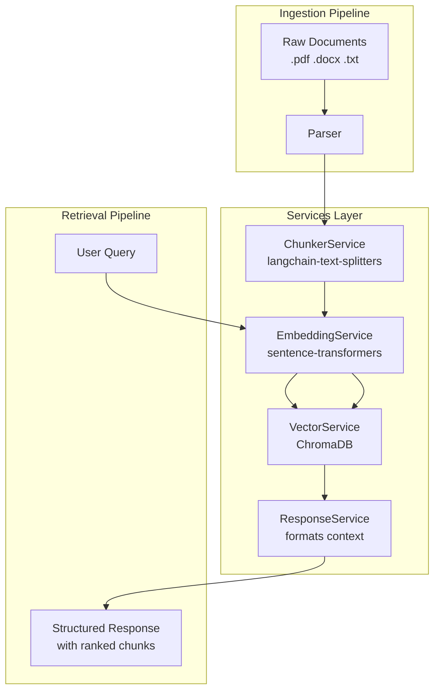

# RAG Pipeline - Project Plan

## Overview

A service-oriented RAG (Retrieval-Augmented Generation) system with four dedicated service classes
consumed by an ingestion pipeline and a retrieval pipeline.

---

## Architecture



---

## Libraries

| Library                    | Purpose                                      |
|---------------------------|----------------------------------------------|
| `pymupdf`                 | PDF text extraction (page-by-page)           |
| `python-docx`             | Word document (.docx) parsing                |
| `langchain-text-splitters`| RecursiveCharacterTextSplitter for chunking  |
| `sentence-transformers`   | Local embedding model (all-MiniLM-L6-v2)     |
| `chromadb`                | Local persistent vector store (cosine sim)   |

---

## Project Structure

```
Chatbot_RAG/
├── services/
│   ├── __init__.py
│   ├── embedding_service.py      # EmbeddingService
│   ├── chunker_service.py        # ChunkerService
│   ├── vector_service.py         # VectorService
│   └── response_service.py       # ResponseService
├── ingestion/
│   ├── __init__.py
│   ├── parser.py                 # PDF / DOCX / TXT → raw text + metadata
│   └── pipeline.py               # IngestionPipeline (orchestrator)
├── retrieval/
│   ├── __init__.py
│   └── pipeline.py               # RetrievalPipeline (orchestrator)
├── data/
│   └── documents/                # Drop raw files here
├── chroma_db/                    # Auto-created by ChromaDB
├── config.py                     # All settings in one place
├── ingest.py                     # CLI: python ingest.py --dir data/documents
├── retrieve.py                   # CLI: python retrieve.py --query "your question"
├── requirements.txt
├── plan.md                       # This file
└── README.md
```

---

## Services

### EmbeddingService — `services/embedding_service.py`

Loads the sentence-transformer model once on init and exposes a single encode method.

- `__init__(model_name)` — loads `SentenceTransformer`
- `encode(texts: list[str]) -> list[list[float]]` — returns embedding vectors

### ChunkerService — `services/chunker_service.py`

Splits raw text into overlapping chunks and attaches source metadata.

- `__init__(chunk_size, chunk_overlap)` — configures splitter
- `chunk(text: str, source: str) -> list[dict]`
  - Each dict: `{ "text": "...", "source": "file.pdf", "chunk_index": 0 }`

### VectorService — `services/vector_service.py`

Wraps ChromaDB. Handles persistence, upsert, and cosine similarity search.

- `__init__(chroma_path, collection_name)` — opens or creates collection
- `add(chunks: list[dict], embeddings: list[list[float]]) -> None`
- `search(query_embedding: list[float], top_k: int) -> list[dict]`
  - Returns: `{ "text", "source", "chunk_index", "distance" }` per result

### ResponseService — `services/response_service.py`

Formats vector search results into a structured response object.
Designed as the LLM extension point — swap in an LLM call here later.

- `build(query: str, results: list[dict]) -> dict`
  - Returns: `{ "query": "...", "answer_context": [...], "sources": [...] }`

---

## Pipelines

### IngestionPipeline — `ingestion/pipeline.py`

```
for each file in directory:
    text, metadata = Parser.parse(file)
    chunks         = ChunkerService.chunk(text, source=file)
    embeddings     = EmbeddingService.encode([c["text"] for c in chunks])
    VectorService.add(chunks, embeddings)
```

### RetrievalPipeline — `retrieval/pipeline.py`

```
query_embedding = EmbeddingService.encode([query])[0]
results         = VectorService.search(query_embedding, top_k)
response        = ResponseService.build(query, results)
return response
```

---

## Configuration — `config.py`

```python
EMBEDDING_MODEL  = "all-MiniLM-L6-v2"
CHUNK_SIZE       = 512
CHUNK_OVERLAP    = 50
CHROMA_PATH      = "./chroma_db"
COLLECTION_NAME  = "rag_docs"
TOP_K            = 5
```

---

## CLI Usage

```bash
# Install uv (once)
pip install uv

# Install all dependencies (creates venv automatically)
uv sync

# Ingest documents
uv run python ingest.py --dir data/documents

# Query the pipeline
uv run python retrieve.py --query "What is the refund policy?"

# Add a new package later
uv add <package-name>
```

---

## Extension Points

- **Add an LLM**: update `ResponseService.build()` to pass `answer_context` to OpenAI / Ollama / HuggingFace
- **Add more file types**: extend `ingestion/parser.py` with new handlers (e.g. `.html`, `.csv`)
- **Swap vector store**: replace `VectorService` internals with FAISS or Pinecone without touching pipelines
- **Change embedding model**: update `EMBEDDING_MODEL` in `config.py` — everything else adapts automatically
